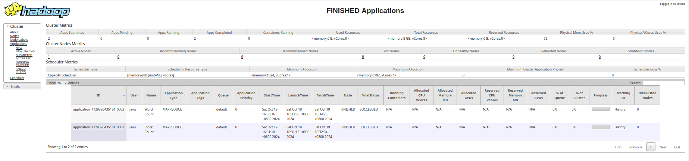

# 作业5
## 一、设计思路：
### 任务1：统计数据集上市公司股票代码（"stock"列）的出现次数，按出现次数从⼤到⼩输出，输出格式为"<排名>：<股票代码>，<次数>"
Mapper用于解析输入 CSV 文件的每一行，提取第四个字段（股票代码）并输出键值对 <股票代码, 1>。
Reducer用于接收每个股票代码对应的所有值并汇总每个股票代码的总出现次数。
使用一个 TreeMap 来保持所有股票代码，先将股票出现次数作为key从高到低排序，排序后key与value互换输出。
### 任务2：统计数据集热点新闻标题（"headline"列）中出现的前100个⾼频单词，按出现次数从⼤到⼩输出。要求忽略⼤⼩写，忽略标点符号，忽略停词（stop-word-list.txt）。输出格式为"<排名>：<单词>，<次数>"。
Mapper用于解析输入 CSV 文件的每一行，提取第二个字段（标题）并清洗文本，去除标点符号，转换为小写；同时分割成单词，过滤停用词。最终输出键值对 <单词, 1>。
Reducer用于接收每个单词对应的所有值（1）并汇总每个单词的总出现次数。
与上面的思路相同，使用一个 TreeMap 来保持前100个高频单词，按出现次数从高到低排序。
## 二、程序运行结果：
见output文件夹下的task1和task2中的输出文件即可。
任务完成截图如下：

## 三、存在的不足与可能的改进之处：
### 1、每次任务仅使用一个reducer可能造成单个reducer的载荷问题：
由于选取的是一个treeMap进行一次性的全局排序，没有将数据分开载入几个reducer中进行排序，这样可能会导致单个reducer的载荷过高，不过在这个场景下不存在这个问题。
### 2、使用伪分布式hadoop运行，未使用集群式运行：
本mapreduce程序在伪分布式hadoop上运行，并没有完美地模拟集群式的运行。
